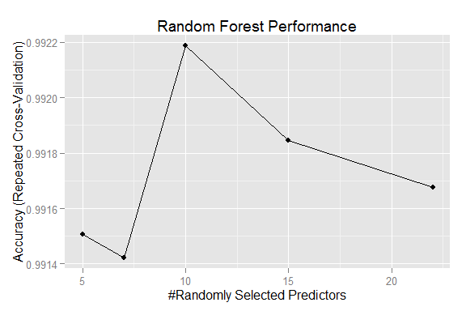
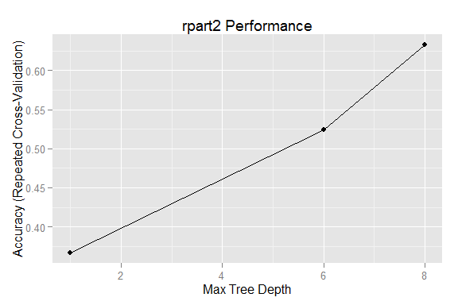
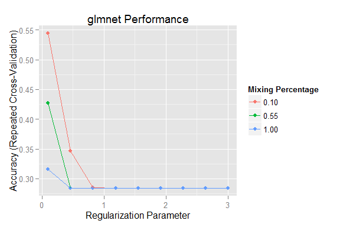

# Weight Lifting Exercise Analysis
Van Hai Ho  
August 18, 2014  

# Summary

Regular exercise is recommended even for healthy adults. People often quantify *how much* a particular exercise activity they do, but they rarely quantify *how well* they do it. This report provides an analysis and attempts to predict the manner in which people did the exercise.

The classification models built for analysis in this report are based on the Weight Lifting Exercise data set available at <https://d396qusza40orc.cloudfront.net/predmachlearn/pml-training.csv>. The classifiers was tested with 10-fold cross-validation. Random Forest algorithm scores the best accuracy, with overall accuracy of around 99.2%.

# Data Processing 

## Setting Environment <a name="settingenv"></a>

We started the analysis with a clean environment. Working directory was set and the required packages were loaded into the environment to be used for analysis.


```r
# Clean up the environment
rm(list = ls())
# Set working directory
setwd("K:/Passage/training/coursera/Data_Science/08_Practical_Machine_Learning/project/project_writeup")

library(caret); library(kernlab); library(randomForest); 
library(plyr); library(glmnet); library(rpart); library(ggplot2)
library(doParallel)
cl <- makePSOCKcluster(4)
registerDoParallel(cl)
```

## Getting and Cleaning Data <a name="gettingAndCleaningData"></a>

The analysis in this report acquires the data set from the following link:

* Training data: https://d396qusza40orc.cloudfront.net/predmachlearn/pml-training.csv
* Test data: https://d396qusza40orc.cloudfront.net/predmachlearn/pml-testing.csv


```r
# Check if the data file has been downloaded to working directory.
# If not, download it from the course website
trainDataFile <- "pml-training.csv"
if (!file.exists(trainDataFile)) {
    fileUrl <- "https://d396qusza40orc.cloudfront.net/predmachlearn/pml-training.csv"
    download.file(fileUrl, destfile=trainDataFile)
}

testDataFile <- "pml-testing.csv"
if (!file.exists(testDataFile)) {
    fileUrl <- "https://d396qusza40orc.cloudfront.net/predmachlearn/pml-testing.csv"
    download.file(fileUrl, destfile=testDataFile)
}
```

The training data set contains 19,622 observations with 160 variables on six (6) users. This data set contains empty fields and <code>#DIV/0!</code> which will be considered as missing values <code>NA</code> in this report.


```r
# Load data
trainData <- read.csv(trainDataFile, header = TRUE, sep = ",", 
                      na.strings = c("NA", "", "#DIV/0!"));
testData <- read.csv(testDataFile, header = TRUE, sep = ",", 
                     na.strings = c("NA", "", "#DIV/0!"))
```

There are five (5) classes: A, B, C, D, and E to classify how well an activity was performed by the user. Class A corresponds to the specified execution of the exercise, while the other 4 classes correspond to common mistakes:

* Class A: exactly according to the specification,
* Class B: throwing the elbows to the front,
* Class C: lifting the dumbbell only halfway,
* Class D: lowering the dumbbell only halfway, and
* Class E: throwing the hips to the front.

The measurements in the data set collected from the following:

* 4 sensors: belt, arm, dumbbell, glove
* 3 calculated Euler angles and 3 raw features for each sensor: roll, pitch, yaw, accelerometer, gyroscope and magnetometer;
* 8 calculated features: mean, variance, standard deviation, max, min, amplitude, kurtosis and skewness.

There are many variables that are mostly filled with missing values. The variables with more than 95% of missing values are excluded from the data used to build the models. user_name, time and windows related fields are not needed for building the models, therefore they are excluded as well.


```r
# Exclude variables with more than 95% of missing ("NA"") values
# e.g. only include variables with less than 5% of missing values
trainingRows <- nrow(trainData)
cleanedTrainData <- trainData[, (colSums(is.na(trainData)) < trainingRows * 0.05)]

# Exclude variables that are not used for classification
unusedVars <- c("X", "user_name", "raw_timestamp_part_1", "raw_timestamp_part_2", 
                "cvtd_timestamp", "new_window", "num_window")
cleanedTrainData <- cleanedTrainData[, -which(names(cleanedTrainData) %in% unusedVars)]
cleanedVars <- names(cleanedTrainData)

# Select variables for test set
cleanedTestData <- testData[, which(names(testData) %in% cleanedVars)]
cleanedTestData$problem_id <- testData[, "problem_id"]
```

The training data set was splitted into 2 parts: training and validating. The training part was used to build the models. The validating part was used to validate the performance of the models.


```r
set.seed(2122)
inTrain <- createDataPartition(y = cleanedTrainData$classe, p = 0.60, list = FALSE)
training <- cleanedTrainData[inTrain, ]
validating <- cleanedTrainData[-inTrain, ]
```

# Classification Models

In this section, we considered three classification models to recognise and predict the manner of how users perform their exercise acticity. 

## Random Forest (rf)

The data used in this analysis are sensor data which are often noisy. Hence the Random Forest approach was chosen to tackle this characteristic of noisy sensor data. In Random Forest approach, training algorithm searches over a random subset with the same distribution when splitting a node to build the trees in the forest. It is then combined with randomised node optimisation to generate classification result. 

To build the random forest, we first tried to find the optimal numbers of variables to try splitting on at each node. These numbers were used to tune up the model. To improve the performance, we used 10-fold cross-validation with <code>repeatedcv</code> method.


```r
#  find the optimal numbers of variables to try splitting on at each node
bestmtry <- tuneRF(training[-53], training$classe, ntreeTry = 100, 
                   stepFactor = 1.5, improve = 0.01, trace = FALSE, 
                   plot = FALSE, dobest = FALSE)

# Use bestmtry as tuning parameters for random forest
tuneParams <- data.frame("mtry" = bestmtry[, 1])

# Use 10 folds cross-validation 
rfCtrl <- trainControl(method = "repeatedcv", number = 10)

# Run the algorithm to train the model
trainRF <- train(classe ~ ., data = training, method = "rf",
                 preProcess = c("center", "scale"),
                 trControl = rfCtrl, tuneGrid = tuneParams)
```

The performance of <code>rf</code> model is shown in the following graph. All four models trained for the random forest achieve more 90% accuracy. The best model scores 99.2% accuracy.

 

With random forest best model, the expected out of sample error is quite low, less than 1%:

```
## 
## Call:
##  randomForest(x = x, y = y, mtry = param$mtry) 
##                Type of random forest: classification
##                      Number of trees: 500
## No. of variables tried at each split: 10
## 
##         OOB estimate of  error rate: 0.65%
## Confusion matrix:
##      A    B    C    D    E class.error
## A 3344    4    0    0    0    0.001195
## B   14 2258    7    0    0    0.009215
## C    0   11 2037    6    0    0.008277
## D    1    0   22 1905    2    0.012953
## E    0    0    3    6 2156    0.004157
```

Next, we validated the <code>rf</code> training model on <code>validating</code> data:


```r
valPred <- predict(trainRF, newdata = validating)
valCfm <- confusionMatrix(valPred, reference = validating$classe)
```

The result of prediction using the best model for <code>rf</code> algorithm on the validating data is shown below:


```
##           Reference
## Prediction    A    B    C    D    E
##          A 2230   14    0    0    0
##          B    1 1503   11    0    0
##          C    0    1 1347   19    2
##          D    1    0   10 1265    2
##          E    0    0    0    2 1438
```

The overal accuracy of the prediction using the best model of <code>rf</code> algorithm on the validating data set:


```
## Accuracy 
##    0.992
```

## Recursive Partitioning and Regression Trees (rpart2)

The training data set contains large number of variables. Some variables might influence the others. Hence <code>rpart2</code> model is chosen.


```r
## rpart classification
trainCART <- train(classe ~ ., data = training, method = "rpart2",
                  preProcess = c("center", "scale"), trControl = rfCtrl)

# Validating model
valPred <- predict(trainCART, newdata = validating)
valCfm <- confusionMatrix(valPred, validating$classe)
```

The performance of <code>rpart2</code> training model:

 

The result of prediction using the best model of <code>rpart2</code> on the validating data is shown in the table below.


```
##           Reference
## Prediction    A    B    C    D    E
##          A 1952  327   46  110  134
##          B   34  625   68   47   21
##          C  182  223 1055  663  281
##          D   42  151  165  391   69
##          E   22  192   34   75  937
```

The overal accuracy of the prediction using the best model of <code>rpart2</code> on the validating data set:


```
## Accuracy 
##   0.6322
```

## Generalized Linear Model via Penalized Maximum Likelihood (glmnet)

Generalized Linear Model via penalized maximum likelihood can deal with all shapes of data, including very large sparse data matrices. Thus, it was chosen to see if it works well for noisy sensor data used in this report.


```r
## generalized linear model
trainGlmnet <- train(classe ~ ., data = training, method = "glmnet",
                   preProcess = c("center", "scale"), trControl = rfCtrl)

# Validating model
valPred <- predict(trainGlmnet, newdata = validating)
valCfm <- confusionMatrix(valPred, validating$classe)
```

The performance of <code>glmnet</code> training model:

 

The result of prediction using the best model of <code>glmnet</code> on the validating data is shown in the table below:


```
##           Reference
## Prediction    A    B    C    D    E
##          A 1723  555  612  177  257
##          B  113  622   87  138  295
##          C  107  188  560  151  138
##          D  265  106   45  698  118
##          E   24   47   64  122  634
```

The overal accuracy of the prediction using the best model of <code>glmnet</code> on the validating data set:


```
## Accuracy 
##     0.54
```

Amongst three classification models validated in this report, Random Forest yields the best accuracy. We will use this model to generate prediction for the test data.

# Prediction

In this section, we used Random Forest model, the best training model built in previous section, to predict the outcome for 20 test cases provided in <https://d396qusza40orc.cloudfront.net/predmachlearn/pml-testing.csv>.


```r
predict(trainRF, newdata = cleanedTestData)
```

```
##  [1] B A B A A E D B A A B C B A E E A B B B
## Levels: A B C D E
```

The accuracy of the predictions for this test set is measured in the submission part of the project.

# Conclusion

Quality of the exercise activity can be automatically measured and predicted in order to give feedback to users to improve their activity. With the data set used in this report, random forest algorithm yields the best prediction accuracy.

